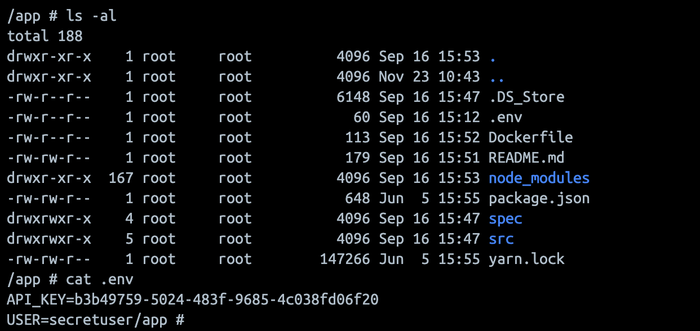
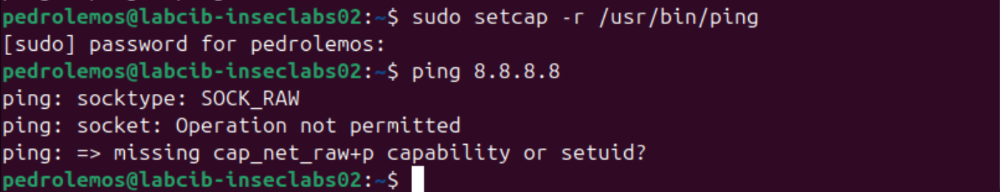
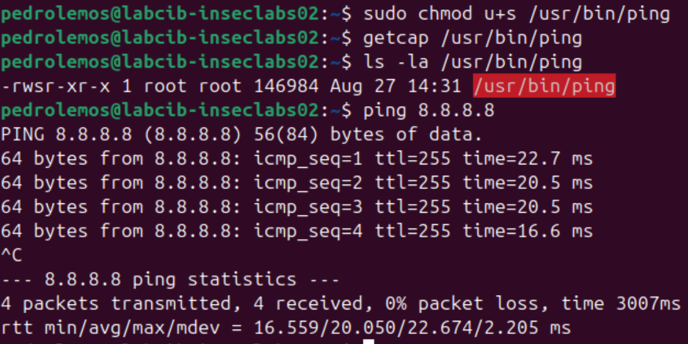
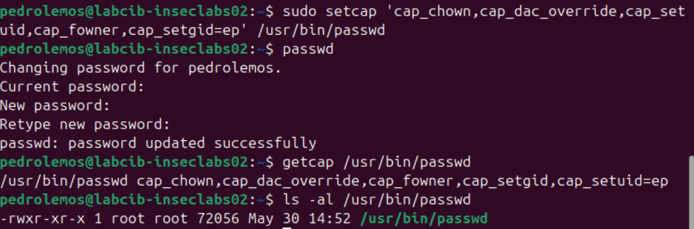

# Part 1: Keeping Secrets OUT of Docker Images

**Question** **1.** **What is the issue here?**

The issue is that the instructions are copying everything with `COPY . .`. This instruction is also copying file .env that contains the secrets and this leaves the secrets in the Docker container, able to be read by everyone that can enter the container.

**Question** **2.** **Can you recover the actual secrets from the image? Detail how.**

First we pull the image with `docker pull isepdei/insecurelabs01`, then we go inside the container and read the file



**Question** **3.** **What do you think of Tom’s fix?**

This new approach still has some issues. Even though the file is deleted in `RUN rm .env`, the file is still copied to the container, and this is still a risk since it is still possible to retrieve the file.

**Question** **4.** **Is it possible to recover the new API key now[^P13] ? Provide detailed instructions.**

**Question** **5.** **So, how would you go about doing Scott’s job? Would you do something different? Explain in detail.**

# Part 2: Docker and Linux Capabilities

## Introduction

This is the second part of the *Isolation Lab*, where you are going to experiment with various aspects of software Isolation using Docker. If you haven't, checkout Part I for a longer intro and the first set of experiments.

## Setup

You will need a modern Linux Distribution and Docker. We suggest using a prebuilt Linux VM[^P21] and install Docker on the VM. Windows WSL should be able to support this lab but was not tested.

## Intro to Linux Capabilities

Traditional UNIX systems categorize processes into two types: **privileged processes**, which have an effective user ID (UID) of 0 and are commonly referred to as superuser or root, and **unprivileged processes**, which have a nonzero effective UID. A special type of executables, called **Set UID** (Set User ID), allow users to run the program with the file owner's privileges, rather than their own. This is useful in scenarios where certain actions require higher privileges, such as administrative tasks, but users should not have full access to those elevated privileges. A common example of a Set UID program is the `passwd` command, which allows a regular user to change their password. The system password file (like `/etc/passwd` or `/etc/shadow`) is typically only writable by root, but when a user runs `passwd`, it executes with root privileges (thanks to Set UID), allowing the password change while maintaining system security. Because Set UID programs run with elevated privileges, they pose security risks if not implemented carefully. Set UID programs must be carefully scrutinized.  

You can see that a program has Set UID by looking at its permissions. The program **passwd**, needs Set UID permission (notice the ‘**s**’ in the user permissions):

```
# ls -la /usr/bin/passwd
-rw**s**r-xr-x 1 root root 55544 fev 6 2024 /usr/bin/passwd
```

Instead of granting full privileged access (as Set UID does), we can split the privileges once reserved for the superuser into smaller, discrete units called **Capabilities**[^P22]. Capabilities were introduced in the Linux Kernel since a while back (Kernel version 2.2). For example, Capabilities, such as CAP_NET_BIND_SERVICE to allow binding to ports below 1024 (something typically reserved for privileged services[^P23]), or CAP_SYS_BOOT to allow rebooting the system (there are many more; see them in references given in the footnotes). **Linux Capabilities are widely used in container platforms (such as Docker) to restrict what a process inside the container can do, improving security isolation**. 

One example of a program that uses Capabilities is **ping**. It needs RAW sockets because it directly constructs and sends ICMP (Internet Control Message Protocol) packets, bypassing transport layer protocols like TCP or UDP. Use `getcap` to see a program’s capabilities (**cap_net_raw** is the name of the capability and **ep** refers to the Effective (e) and Permitted (p) capability sets):

```
# getcap /usr/bin/ping
/usr/bin/ping cap_net_raw=ep  
```

Please take a few moments to read the reference man pages and learn more about capability sets, processes, files, users, and ambient capabilities.

**Question** **6.** **What happens if you remove** **`cap_net_raw` from ping? Describe how you removed the capability.**

To remove the `cap_net_raw` capability from the ping command, we used the following command

```
sudo setcap -r /usr/bin/ping
```

After doing this, we were observed that we were no longer able to run the ping command:




**Question** **7.** **Can you make ping work again without adding any capability, and without running with** **sudo?**

To make it so that ping works again without adding any capability and without running it as sudo, we turned it into a SetUID program by using the following command:

```
sudo chmod u+s /usr/bin/ping
```

Then, we were able to confirm that ping works again, even though no capabilities were added and we're running it as an unprivileged user.




**Question** **8.** **Can you make** **passwd work without being a Set UID program? Detail how and why it works?**

To test this, first we removed the SetUID permission from the passwd executable by running:

```
sudo chmod u-s /usr/bin/passwd
```

Since now the passwd binary doesn't have this permission, it will no longer work. So, to restore it to working order without setting its SetUID permission again we used capabilities. We thought about what the passwd exectuable actually does, which is manipulate files such as `/etc/shadow` to change a user's password. This file is only writable by the root user, so capabilities related to overriding file permissions would surely be necessary.

After testing different combinations, we concluded that the following group of capabilities are necessary:

- `CAP_DAC_OVERRIDE`: To override file permissions (needed for accessing /etc/shadow).
- `CAP_FOWNER`: To allow ownership-related operations on files like /etc/shadow, for instance, changing the modification timestamp.
- `CAP_CHOWN`: To change the ownership of files, if required.
- `CAP_SETUID` and `CAP_SETGID`: To change user and group IDs during the password update process.

After setting these capabilities, and running passwd as a non-SetUID program, we were able to confirm that it works again. It does so due to the fact that it has the required capabilities to perform the actions it needs to (as we've presented previously), even though it does not have the SetUID permission.



**Question** **9.** **Discuss why do you think that, by default,** **passwd is a Set UID program and** **ping is not?**

By default, `passwd` is a setuid program because it requires root permissions to modify files like `/etc/shadow`, which hold password hashes and thus is considered sensitive. Normal users don't have the permissions to change these files, and so `passwd` must run with elevated privileges to perform its function properly and securely. Additionally, since the capabilities that would be required are quite broad and could encompass even more than the ones we've set (depending on specific authentication characteristics of the system), having passwd as a SetUID ensures further compatibility as well as ease of management.

The `ping` command, however, does not need to be a setuid program. This executable only requires the `CAP_NET_RAW` capability to open raw sockets for sending ICMP packets, and no other capability, so it is much safer to provide it as a normal executable with this capability, rather than a setuid program, which could introduce unwarranted risks. 

**Question** **10.** **Can you get familiar with other capabilities? On you report explain ten more capabilities of your choice.**

| Capabilities | Description | Practical Use Case |
|---|-----|-----|
| **cap_setfcap** | Allows a process to set file capabilities, which define the privileges that files or executables have when executed. Elevates privileges on binaries. |  A file manager application modifies the file capabilities of an executable to allow it to bind to privileged ports (e.g., below 1024) without running as root. For instance, enabling `CAP_NET_BIND_SERVICE`. |
| **cap_mac_override** | Allows a proccess to override MAC rules. Enables to bypass security policies. | A backup application overrides SELinux policies to access and back up sensitive system files that would otherwise be restricted by the security policy. |
| **cap_mac_admin** | Allows to manage and configure MAC policies. | A system administrator tool modifies SELinux or AppArmor policies to temporarily relax access controls during troubleshooting or to install software requiring non-standard permissions. |
| **cap_syslog** | Allows to read and configure kernel messages through `dmesg` or `/proc/kmsg`.  | A log monitoring tool like `rsyslog` reads the kernel log buffer (`dmesg`) to analyze kernel errors, crashes, or anomalies in real time. |
| **cap_wake_alarm** | Set the ability to a program to trigger something that will wake up the system (set `CLOCK_REALTIME_ALARM` and `CLOCK_BOOTTIME_ALARM` timers). | A scheduling service like `cron` uses wake alarms to wake the system from sleep to execute a scheduled backup or maintenance task at a specific time, ensuring that important jobs are not missed. |
| **cap_block_suspend** | Allows the process to block features that can block system suspend. | A media streaming application prevents the system from entering suspend mode while actively playing content, ensuring the stream isn't interrupted during playback. |
| **cap_audit_read** | Permits to read the audit log via multicast netlink. | A compliance monitoring tool reads security audit logs generated by the Linux Audit Framework to detect and alert on unauthorized access attempts or policy violations. |
| **cap_perfmon** | Allows access to performance monitoring capabilities. It is used for debugging or profiling system performance. | A performance profiling tool like `perf` or `bpftrace` accesses hardware performance counters to analyze CPU and memory usage during application execution for debugging or optimization. |
| **cap_bpf** | Allows to access and manage BPF. It is used for packet filtering, monitoring, and dynamic code execution in the kernel. | A network monitoring tool uses Berkeley Packet Filters (BPF) to capture and analyze network packets in real time, allowing for advanced filtering and inspection without excessive overhead. |
| **cap_checkpoint_restore** | Allows the process to use checkpoint and restore features. | A container orchestration system like CRIU (Checkpoint/Restore in Userspace) checkpoints a running container, saves its state, and later restores it on another host to enable seamless migration. |

**Question** **11.** **After a program (running as normal user) disables a** **`cap_dac_override` capability, it is compromised by a buffer-overflow attack. The attacker successfully injects his malicious code into this program’s stack space and starts to run it. Can this attacker use the** **`cap_dac_override` capability? What if the process deleted the capability, can the attacker use the capability?**

Yes, the attacker can use the CAP_DAC_OVERRIDE capability if it has only been disabled. Disabling the capability removes it from the effective set, but not from the permitted set. Since the capability remains in the permitted set, the process is still allowed to re-enable it. This means the attacker, upon compromising the process, can re-enable the capability and use it to carry out part of the attack.

On the other hand, if the capability has been deleted, it is removed from both the effective set and the permitted set. Without the capability in the permitted set, the attacker cannot add it back to the process. As a result, the attacker would not be able to use this capability to conduct any subsequent attacks.

**Question** **12.** **What are the inheritable, permitted and effective capabilities of a process running in the container (look at the `proc` filesystem output)? Compare to the output of** **`capsh –-print`.**

When running `capsh --print`, we get the following listing of capabilities:

```
$ docker exec captest sh -c 'capsh --print'
Current: cap_chown,cap_dac_override,cap_fowner,cap_fsetid,cap_kill,cap_setgid,cap_setuid,cap_setpcap,cap_net_bind_service,cap_net_raw,cap_sys_chroot,cap_mknod,cap_audit_write,cap_setfcap=ep
Bounding set =cap_chown,cap_dac_override,cap_fowner,cap_fsetid,cap_kill,cap_setgid,cap_setuid,cap_setpcap,cap_net_bind_service,cap_net_raw,cap_sys_chroot,cap_mknod,cap_audit_write,cap_setfcap
```

When looking at the proc filesystem output, we get the following information:

```
$ docker exec captest sh -c 'cat /proc/1/status | grep Cap'
CapInh:	0000000000000000
CapPrm:	00000000a80425fb
CapEff:	00000000a80425fb
CapBnd:	00000000a80425fb
CapAmb:	0000000000000000
```

Which, when decoded, translates to:

```
$ docker exec captest sh -c 'capsh --decode=00000000a80425fb'
0x00000000a80425fb=cap_chown,cap_dac_override,cap_fowner,cap_fsetid,cap_kill,cap_setgid,cap_setuid,cap_setpcap,cap_net_bind_service,cap_net_raw,cap_sys_chroot,cap_mknod,cap_audit_write,cap_setfcap
```

From this information, we conclude that the permitted and effective capabilities of a process running in the container are the same as the ones listed by `capsh --print`, which have been presented above. However, by inspecting the output of `proc`, we're able to see that CapInh is set to 0, unlike CapPrm, CapEff and CapBnd, which means that a process which is a child of the root process will not inherit its capabilites, since the set of inheritable capabilities is empty.

**Question** **13.** **Do you notice any issue when you try to do a `ping` again? Explain why and how can you fix it while still running with** **`--cap-drop` all.**

The issue arises because the ping command requires the CAP_NET_RAW capability to construct and send ICMP packets, but running the container with --cap-drop all removes all capabilities, including the required one. As a result, trying to run ping without the necessary capability results in the error:
```
sh: 1: ping: Operation not permitted
```

To fix this while still running the container with --cap-drop all, you can explicitly add back only the required capability (CAP_NET_RAW) using the --cap-add flag:

```
docker run --name captest --cap-drop all --cap-add NET_RAW -d -p 8000:80 isepdei/capabilities01
```

The ping executable requires CAP_NET_RAW, as can be verified with getcap /usr/bin/ping and the output is the following:

```
$ getcap /usr/bin/ping
/usr/bin/ping cap_net_raw=ep
```

By adding only the CAP_NET_RAW capability using --cap-add, we grant the container just enough privilege to allow ping to operate, while still dropping all other capabilities for enhanced security.

After starting the container, you can verify the current capabilities using:

```
docker exec captest bash -c 'capsh --print'
```

The output should show that only CAP_NET_RAW is enabled in the effective (ep) and bounding set, confirming minimal privilege configuration :

```
$ docker exec captest bash -c 'capsh --print'
Current: cap_net_raw=ep
Bounding set =cap_net_raw
Ambient set =
Current IAB: !cap_chown,!cap_dac_override,!cap_dac_read_search,!cap_fowner,!cap_fsetid,!cap_kill,!cap_setgid,!cap_setuid,!cap_setpcap,!cap_linux_immutable,!cap_net_bind_service,!cap_net_broadcast,!cap_net_admin,!cap_ipc_lock,!cap_ipc_owner,!cap_sys_module,!cap_sys_rawio,!cap_sys_chroot,!cap_sys_ptrace,!cap_sys_pacct,!cap_sys_admin,!cap_sys_boot,!cap_sys_nice,!cap_sys_resource,!cap_sys_time,!cap_sys_tty_config,!cap_mknod,!cap_lease,!cap_audit_write,!cap_audit_control,!cap_setfcap,!cap_mac_override,!cap_mac_admin,!cap_syslog,!cap_wake_alarm,!cap_block_suspend,!cap_audit_read,!cap_perfmon,!cap_bpf,!cap_checkpoint_restore
Securebits: 00/0x0/1'b0 (no-new-privs=0)
 secure-noroot: no (unlocked)
 secure-no-suid-fixup: no (unlocked)
 secure-keep-caps: no (unlocked)
 secure-no-ambient-raise: no (unlocked)
uid=0(root) euid=0(root)
gid=0(root)
groups=0(root)
Guessed mode: HYBRID (4)
```

# Part 3: Docker Security Evasion

## Introduction

This is the third part of the *Isolation Lab*, where you are going to experiment with various aspects of software Isolation using Docker. If you haven't, start from Part I.

## Setup

For this part of the Lab, you will need a computer with Docker installed.

## Privileged Containers

### Scott is Back

Oh oh, they asked Scott to setup the container on one of SecureLabs’ servers. He was having some issues bringing up the container and ended up with doing this:
```
docker run -d --privileged -p 80:80 isepdei/insecurelabs03
```

**Question** **14.** **What are the capabilities of the container?**

To find the capabilities of the container, we used `capsh` tool, that is used to print details about the Linux capabilities and security settings, in this case, inside the container.
The command executed was `docker exec magical_rubin sh -c 'capsh --print'`, that gave us the following logs:

```
Current: =ep
Bounding set =cap_chown,cap_dac_override,cap_dac_read_search,cap_fowner,cap_fsetid,cap_kill,cap_setgid,cap_setuid,cap_setpcap,cap_linux_immutable,cap_net_bind_service,cap_net_broadcast,cap_net_admin,cap_net_raw,cap_ipc_lock,cap_ipc_owner,cap_sys_module,cap_sys_rawio,cap_sys_chroot,cap_sys_ptrace,cap_sys_pacct,cap_sys_admin,cap_sys_boot,cap_sys_nice,cap_sys_resource,cap_sys_time,cap_sys_tty_config,cap_mknod,cap_lease,cap_audit_write,cap_audit_control,cap_setfcap,cap_mac_override,cap_mac_admin,cap_syslog,cap_wake_alarm,cap_block_suspend,cap_audit_read,cap_perfmon,cap_bpf,cap_checkpoint_restore
Ambient set =
Current IAB: 
Securebits: 00/0x0/1'b0 (no-new-privs=0)
 secure-noroot: no (unlocked)
 secure-no-suid-fixup: no (unlocked)
 secure-keep-caps: no (unlocked)
 secure-no-ambient-raise: no (unlocked)
uid=0(root) euid=0(root)
gid=0(root)
groups=0(root)
Guessed mode: HYBRID (4)
```

With these logs, we can conclude that the container's capabilities are:
`cap_chown`,
`cap_dac_override`,
`cap_dac_read_search`,
`cap_fowner`,
`cap_fsetid`,
`cap_kill`,
`cap_setgid`,
`cap_setuid`,
`cap_setpcap`,
`cap_linux_immutable`,
`cap_net_bind_service`,
`cap_net_broadcast`,
`cap_net_admin`,
`cap_net_raw`,
`cap_ipc_lock`,
`cap_ipc_owner`,
`cap_sys_module`,
`cap_sys_rawio`,
`cap_sys_chroot`,
`cap_sys_ptrace`,
`cap_sys_pacct`,
`cap_sys_admin`,
`cap_sys_boot`,
`cap_sys_nice`,
`cap_sys_resource`,
`cap_sys_time`,
`cap_sys_tty_config`,
`cap_mknod`,
`cap_lease`,
`cap_audit_write`,
`cap_audit_control`,
`cap_setfcap`,
`cap_mac_override`,
`cap_mac_admin`,
`cap_syslog`,
`cap_wake_alarm`,
`cap_block_suspend`,
`cap_audit_read`,
`cap_perfmon`,
`cap_bpf`,
`cap_checkpoint_restore`.

**Question** **15.** **Can you tell what can go wrong? Provide a detailed exploit of the issue, showcasing some compromise of the container’s host (for some reason, Scott installed `fdisk` on the container).**

The root of the problem here is that running a container with the `--privileged` flag grants it full access to the host system. Not only is access to sensitive files and directories of the host granted, but the container is also granted the full set of Linux capabilities, as we can see below: 


One of the possible exploits is tampering with the filesystem of the host from inside of the container, which could cause critical damage in a production scenario. We shall demonstrate what this exploit could look like and the harm that it could do.

If, when inside the container, we run `fdisk -l`, we'll be able to see the partitions of the host system, confirming the information provided previously:


Furthermore, due to the elevated privileges described, we're able to mount this host filesystem on the container, thus granting us access to the host's files. In this case, the `/boot` partition was mounted:


Deleting the contents of this partition, for example, could render the host system unbootable, as the kernel files would no longer be present on the server. It's clear to see that the security concerns caused by running a container with `--privileged` are quite significant.

If we run the container without this flag, however, we can see that this exploit is rendered impossible:


## Advanced Escapes

There are a number of container escapes that rely on the availability of certain capabilities[^P31]. Have a look at the article. 

> Note that some of these exploits might depend on other system configuration, Docker versions, and other layers of isolation Docker relies on (e.g. namespaces, capabilities, seccomp,...).

**Question** **16.** **Can you replicate any of these escapes? Remember that some might not work anylonger. You should test them and explain how you proceeded to make it work. The group will be asked to demo the exploit.** (this question is for extra points)

**Question** **17.** **Finally, what are some good practices regarding Docker security?**