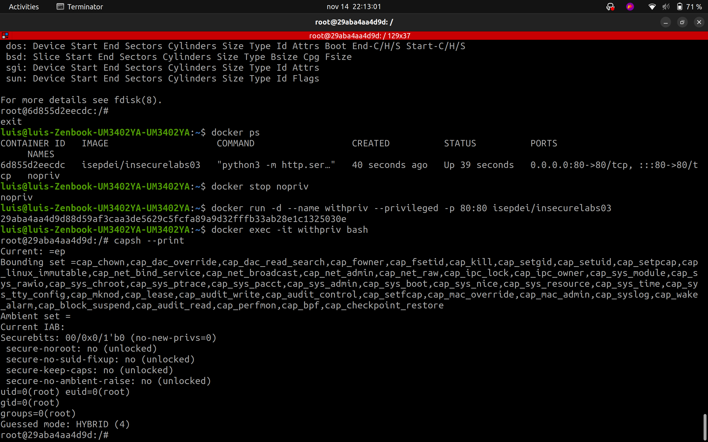
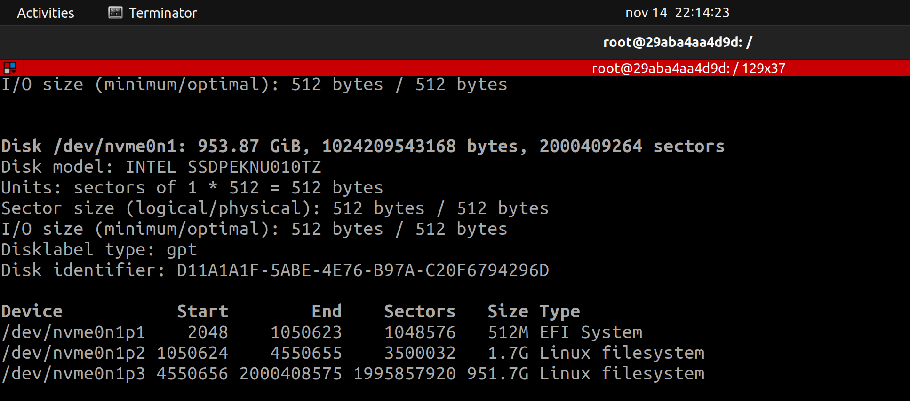
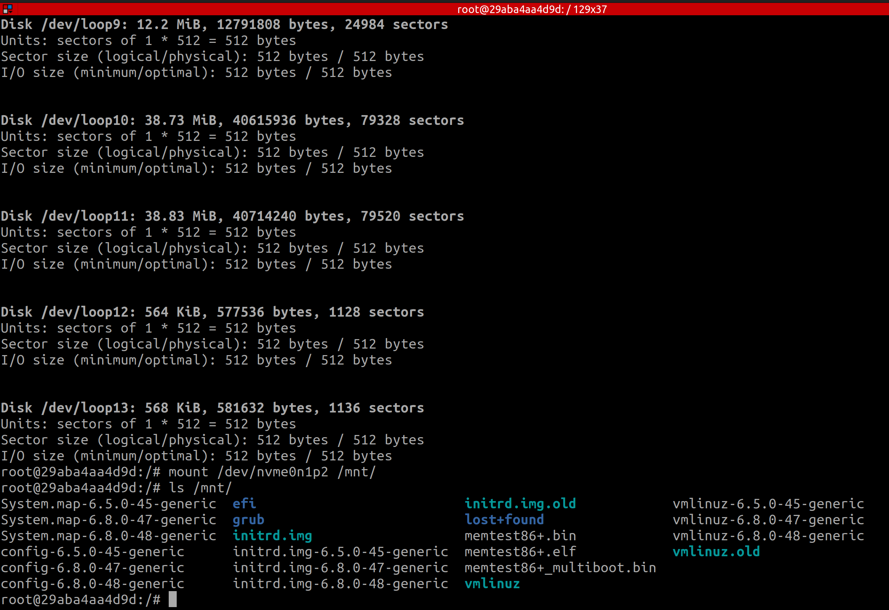
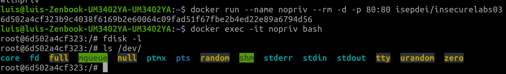

# Part 1: Keeping Secrets OUT of Docker Images

**Question** **1.** **What is the issue here?**

**Question** **2.** **Can you recover the actual secrets from the image? Detail how.**

**Question** **3.** **What do you think of Tom’s fix?**

**Question** **4.** **Is it possible to recover the new API key now[^P13] ? Provide detailed instructions.**

**Question** **5.** **So, how would you go about doing Scott’s job? Would you do something different? Explain in detail.**

# Part 2: Docker and Linux Capabilities

## Introduction

This is the second part of the *Isolation Lab*, where you are going to experiment with various aspects of software Isolation using Docker. If you haven't, checkout Part I for a longer intro and the first set of experiments.

## Setup

You will need a modern Linux Distribution and Docker. We suggest using a prebuilt Linux VM[^P21] and install Docker on the VM. Windows WSL should be able to support this lab but was not tested.

## Intro to Linux Capabilities

Traditional UNIX systems categorize processes into two types: **privileged processes**, which have an effective user ID (UID) of 0 and are commonly referred to as superuser or root, and **unprivileged processes**, which have a nonzero effective UID. A special type of executables, called **Set UID** (Set User ID), allow users to run the program with the file owner's privileges, rather than their own. This is useful in scenarios where certain actions require higher privileges, such as administrative tasks, but users should not have full access to those elevated privileges. A common example of a Set UID program is the `passwd` command, which allows a regular user to change their password. The system password file (like `/etc/passwd` or `/etc/shadow`) is typically only writable by root, but when a user runs `passwd`, it executes with root privileges (thanks to Set UID), allowing the password change while maintaining system security. Because Set UID programs run with elevated privileges, they pose security risks if not implemented carefully. Set UID programs must be carefully scrutinized.  

You can see that a program has Set UID by looking at its permissions. The program **passwd**, needs Set UID permission (notice the ‘**s**’ in the user permissions):

```
# ls -la /usr/bin/passwd
-rw**s**r-xr-x 1 root root 55544 fev 6 2024 /usr/bin/passwd
```

Instead of granting full privileged access (as Set UID does), we can split the privileges once reserved for the superuser into smaller, discrete units called **Capabilities**[^P22]. Capabilities were introduced in the Linux Kernel since a while back (Kernel version 2.2). For example, Capabilities, such as CAP_NET_BIND_SERVICE to allow binding to ports below 1024 (something typically reserved for privileged services[^P23]), or CAP_SYS_BOOT to allow rebooting the system (there are many more; see them in references given in the footnotes). **Linux Capabilities are widely used in container platforms (such as Docker) to restrict what a process inside the container can do, improving security isolation**. 

One example of a program that uses Capabilities is **ping**. It needs RAW sockets because it directly constructs and sends ICMP (Internet Control Message Protocol) packets, bypassing transport layer protocols like TCP or UDP. Use `getcap` to see a program’s capabilities (**cap_net_raw** is the name of the capability and **ep** refers to the Effective (e) and Permitted (p) capability sets):

```
# getcap /usr/bin/ping
/usr/bin/ping cap_net_raw=ep  
```

Please take a few moments to read the reference man pages and learn more about capability sets, processes, files, users, and ambient capabilities.

**Question** **6.** **What happens if you remove** **`cap_net_raw` from ping? Describe how you removed the capability.**

sudo sysctl -w net.ipv4.ping_group_range="0 0" 
sudo setcap -r /usr/bin/ping 
ping 1.1.1.1 ------------> o ping falha, porque nao tem nem a capability, nem o sysctl direito. 

**nota**: para repor ao normal 

sudo sysctl -w net.ipv4.ping_group_range="0 2147483647"
sudo setcap 'cap_net_raw=ep' /usr/bin/ping
ping 1.1.1.1 --------------> volta a dar

**Question** **7.** **Can you make ping work again without adding any capability, and without running with** **sudo?**

sim, recorrendo ao setuid.

sudo chmod u+s /usr/bin/ping

assim conseguimos correr o ping sem a capability e sem o sysctl, porque é como se estivessemos a correr o executavel  como root.

**Question** **8.** **Can you make** **passwd work without being a Set UID program? Detail how and why it works?**

**Question** **9.** **Discuss why do you think that, by default,** **passwd is a Set UID program and** **ping is not?**

**Question** **10.** **Can you get familiar with other capabilities? On you report explain ten more capabilities of your choice.**

**Question** **11.** **After a program (running as normal user) disables a** **`cap_dac_override` capability, it is compromised by a buffer-overflow attack. The attacker successfully injects his malicious code into this program’s stack space and starts to run it. Can this attacker use the** **`cap_dac_override` capability? What if the process deleted the capability, can the attacker use the capability?**

### Trying Linux Capabilities with Docker

Let's explore how Docker uses Capabilities. Note however that Capabilities are only one of the several Linux kernel features Docker relies on to isolate and limit the behavior of containers. **Namespaces** provide separation of resources like processes, networking, and file systems, giving each container its own isolated environment. Control groups (**cgroups**) limit and monitor the container's resource usage (CPU, memory, etc.), preventing any single container from consuming all system resources. Docker uses **seccomp** (secure computing mode) to restrict access to potentially dangerous system calls, reducing the attack surface. In systems where it is available, Docker also uses AppArmor (a **mandatory access control mechanism**) to define what resources a container is allowed to access on the host.

By default, Docker assigns a few default capabilities to containers. We created a ubuntu-based Docker image with the capability library binaries (libcap2-bin) for the purpose of running the Linux capabilities utility programs inside a container and check the container’s capabilities. It is available in Docker Hub: 
- https://hub.docker.com/repository/docker/isepdei/capabilities01/general

You can start a container named **captest** (**`--name captest`**) in background (**`-d`**) with this image (and map container port 80 to host’s port 8000;**`-p 8000:80`**)
```
docker run --name captest -d -p 8000:80 isepdei/capabilities01
```

The container runs a webserver you can test with, e.g., **`curl`**:
```
curl localhost:8000
```

Now, use **`capsh`**[^P24] installed in the container to see the capabilities of a process inside the container (**`docker exec <container_name> <command>`** executes the given command inside the named container):
```
docker exec captest sh -c 'capsh --print'
```

You can also directly check the contents of the container’s **`proc`** filesystem (**`/proc/1/status`** is the status the main container process, with PID 1); this is useful to see quickly all the different capability sets and visually compare the values:
```
docker exec captest sh -c 'grep Cap /proc/1/status'
```

And decode the given values using **`capsh`**:
```
docker exec captest sh -c 'capsh --decode=00000000a80425fb'
```

**Question** **12.** **What are the inheritable, permitted and effective capabilities of a process running in the container (look at the `proc` filesystem output)? Compare to the output of** **`capsh –-print`.**

sao iguais, explicar as semelhanças entre os dois (bound, effective, permitted) - estao nas notas os 2 outputs que devemos comparar. nao vejo outra logica para alem de serem iguais e explicar oq estao a mostrar.

distinguir as inheritable, permitted and effective capabilities.

Try to use the container to perform a **`ping`**:
```
docker exec captest sh -c 'ping www.dei.isep.ipp.pt'
```

Now, let’s stop the container, and start it again dropping all capabilities (**--cap-drop all**):
```
docker stop captest; docker rm captest
docker run --name captest --cap-drop all -d -p 8000:80 isepdei/capabilities01
```

**Question** **13.** **Do you notice any issue when you try to do a `ping` again? Explain why and how can you fix it while still running with** **`--cap-drop` all.**

sh: 1: ping: Operation not permitted

como resolver? 

docker run --name captest --cap-drop all --cap-add NET_RAW -d -p 8000:80 isepdei/capabilities01

adicionamos a cap NET_RAW que é utilizada pelo executavel ping para construir os pacotes ICMP que sao enviados, como podemos ver atraves de: 

```
$ getcap /usr/bin/ping
/usr/bin/ping cap_net_raw=ep
```

tambem podemos comparar as capabilities de agora com as do container "default", e ver que de facto so temos esta que especificamos no --cap-add

```
$ docker exec captest bash -c 'capsh --print'
Current: cap_net_raw=ep
Bounding set =cap_net_raw
Ambient set =
Current IAB: !cap_chown,!cap_dac_override,!cap_dac_read_search,!cap_fowner,!cap_fsetid,!cap_kill,!cap_setgid,!cap_setuid,!cap_setpcap,!cap_linux_immutable,!cap_net_bind_service,!cap_net_broadcast,!cap_net_admin,!cap_ipc_lock,!cap_ipc_owner,!cap_sys_module,!cap_sys_rawio,!cap_sys_chroot,!cap_sys_ptrace,!cap_sys_pacct,!cap_sys_admin,!cap_sys_boot,!cap_sys_nice,!cap_sys_resource,!cap_sys_time,!cap_sys_tty_config,!cap_mknod,!cap_lease,!cap_audit_write,!cap_audit_control,!cap_setfcap,!cap_mac_override,!cap_mac_admin,!cap_syslog,!cap_wake_alarm,!cap_block_suspend,!cap_audit_read,!cap_perfmon,!cap_bpf,!cap_checkpoint_restore
Securebits: 00/0x0/1'b0 (no-new-privs=0)
 secure-noroot: no (unlocked)
 secure-no-suid-fixup: no (unlocked)
 secure-keep-caps: no (unlocked)
 secure-no-ambient-raise: no (unlocked)
uid=0(root) euid=0(root)
gid=0(root)
groups=0(root)
Guessed mode: HYBRID (4)
```

# Part 3: Docker Security Evasion

## Introduction

This is the third part of the *Isolation Lab*, where you are going to experiment with various aspects of software Isolation using Docker. If you haven't, start from Part I.

## Setup

For this part of the Lab, you will need a computer with Docker installed.

## Privileged Containers

### Scott is Back

Oh oh, they asked Scott to setup the container on one of SecureLabs’ servers. He was having some issues bringing up the container and ended up with doing this:
```
docker run -d --privileged -p 80:80 isepdei/insecurelabs03
```

**Question** **14.** **What are the capabilities of the container?**

```
$ docker exec magical_rubin sh -c 'capsh --print'
Current: =ep
Bounding set =cap_chown,cap_dac_override,cap_dac_read_search,cap_fowner,cap_fsetid,cap_kill,cap_setgid,cap_setuid,cap_setpcap,cap_linux_immutable,cap_net_bind_service,cap_net_broadcast,cap_net_admin,cap_net_raw,cap_ipc_lock,cap_ipc_owner,cap_sys_module,cap_sys_rawio,cap_sys_chroot,cap_sys_ptrace,cap_sys_pacct,cap_sys_admin,cap_sys_boot,cap_sys_nice,cap_sys_resource,cap_sys_time,cap_sys_tty_config,cap_mknod,cap_lease,cap_audit_write,cap_audit_control,cap_setfcap,cap_mac_override,cap_mac_admin,cap_syslog,cap_wake_alarm,cap_block_suspend,cap_audit_read,cap_perfmon,cap_bpf,cap_checkpoint_restore
Ambient set =
Current IAB: 
Securebits: 00/0x0/1'b0 (no-new-privs=0)
 secure-noroot: no (unlocked)
 secure-no-suid-fixup: no (unlocked)
 secure-keep-caps: no (unlocked)
 secure-no-ambient-raise: no (unlocked)
uid=0(root) euid=0(root)
gid=0(root)
groups=0(root)
Guessed mode: HYBRID (4)
```

OU

```
root@1b0506d9474d:/# cat /proc/1/status | grep Cap
CapInh:	0000000000000000
CapPrm:	000001ffffffffff
CapEff:	000001ffffffffff
CapBnd:	000001ffffffffff
CapAmb:	0000000000000000
root@1b0506d9474d:/# capsh --decode=000001ffffffffff
0x000001ffffffffff=cap_chown,cap_dac_override,cap_dac_read_search,cap_fowner,cap_fsetid,cap_kill,cap_setgid,cap_setuid,cap_setpcap,cap_linux_immutable,cap_net_bind_service,cap_net_broadcast,cap_net_admin,cap_net_raw,cap_ipc_lock,cap_ipc_owner,cap_sys_module,cap_sys_rawio,cap_sys_chroot,cap_sys_ptrace,cap_sys_pacct,cap_sys_admin,cap_sys_boot,cap_sys_nice,cap_sys_resource,cap_sys_time,cap_sys_tty_config,cap_mknod,cap_lease,cap_audit_write,cap_audit_control,cap_setfcap,cap_mac_override,cap_mac_admin,cap_syslog,cap_wake_alarm,cap_block_suspend,cap_audit_read,cap_perfmon,cap_bpf,cap_checkpoint_restore
```

**Question** **15.** **Can you tell what can go wrong? Provide a detailed exploit of the issue, showcasing some compromise of the container’s host (for some reason, Scott installed `fdisk` on the container).**

o problema e que com privileged podemos aceder ao host que esta a correr o container e partir muita coisa -> procurar o que que o --privileged dá efetivamente.

correr o container com --privileged e ver as capabilities (ja estao la acima): 



se corrermos um `fdisk -l` conseguimos ver as partiçoes de disco do host que esta a correr o container:



ainda pior, conseguimos montar essas partiçoes dentro do container. por exemplo:



assim, nos dentro do container estamos a aceder a uma partiçao de disco do host. isto e muito perigoso pois podemos comprometer totalmente os dados armazenados no host, algo que, com o isolamento apropriado do docker, nao conseguiriamos fazer.

se corrermos o container sem privilegios, vemos que este nao e o caso:



## Advanced Escapes

There are a number of container escapes that rely on the availability of certain capabilities[^P31]. Have a look at the article. 

> Note that some of these exploits might depend on other system configuration, Docker versions, and other layers of isolation Docker relies on (e.g. namespaces, capabilities, seccomp,...).

**Question** **16.** **Can you replicate any of these escapes? Remember that some might not work anylonger. You should test them and explain how you proceeded to make it work. The group will be asked to demo the exploit.** (this question is for extra points)

**Question** **17.** **Finally, what are some good practices regarding Docker security?**