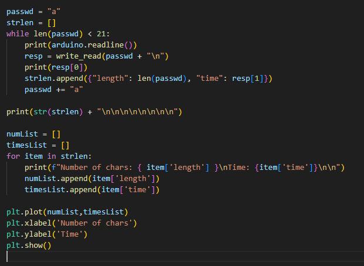
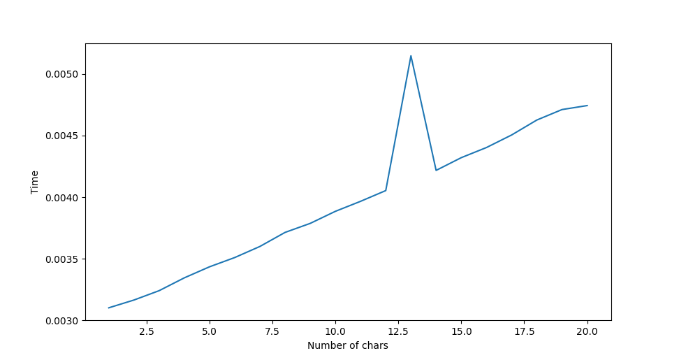
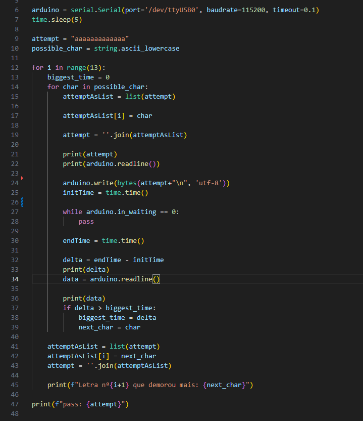
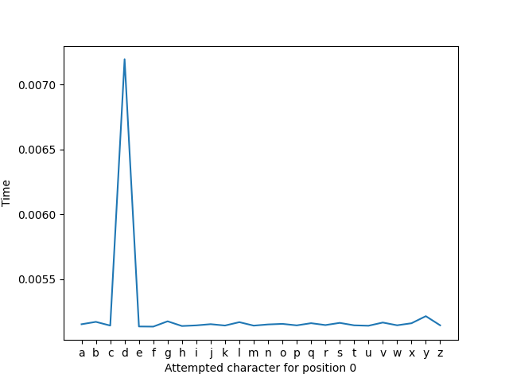
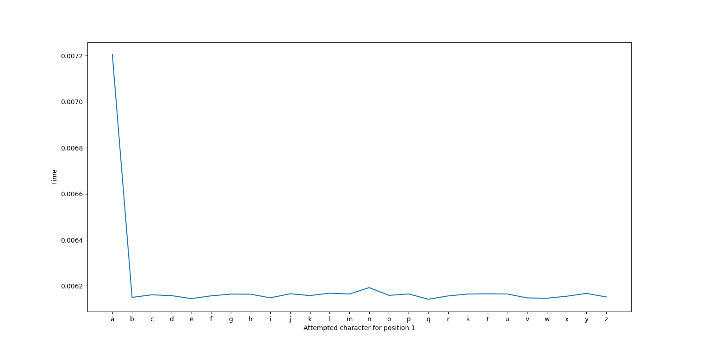
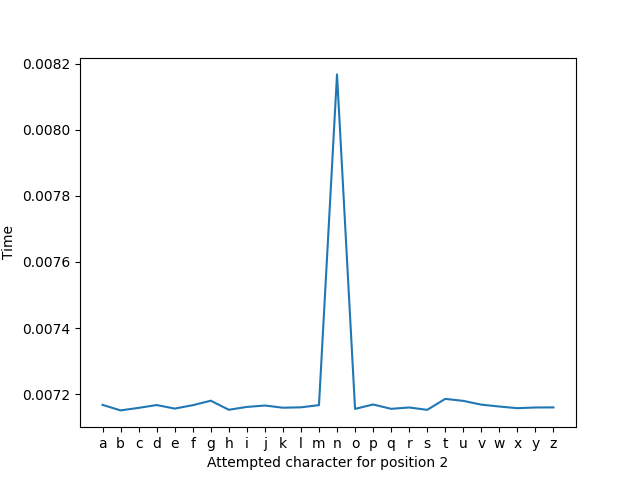
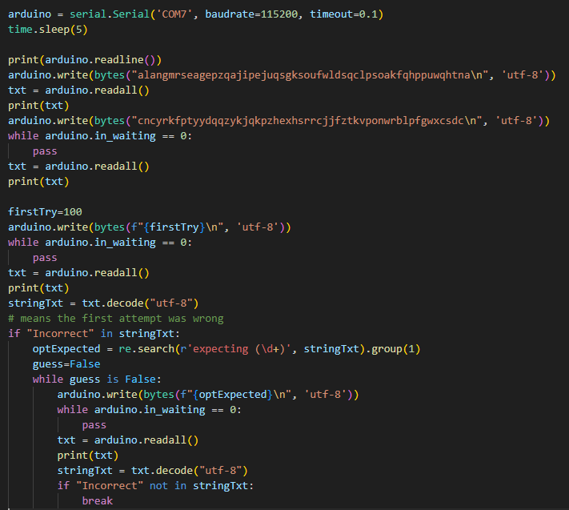

# Lab 1 - Embedded

# Introduction

This file documents all of the work that was developed in the scope of the [Lab 1 project](https://github.com/labcib/lab-embedded) for the LABCIB course unit.

As requested, this introduction describes all files that are delivered, as well as execution instructions for each of them where applicable. We have also compiled the requested [TARGETS folder](./TARGETS/), whose contents will be expanded further on this report.

The included files and directories are the following:
- [findLength.py](findLength.py): script used in Target 1 to obtain the length of the developer's password.
    - Before executing, it's necessary to verify to which port the Arduino is connected, and on Linux systems it's also necessary to grant execution permissions on that device. The path used for all of the scripts was `/dev/ttyUSB0`, but this can be different on other computers. 
    - To execute, grant the permissions specified above, install the requirements found in [requirements.txt](./requirements.txt) and execute it through python:

```
sudo chmod 777 /dev/ttyUSB0 
pip install -r requirements.txt 
python3 findLength.py
```

- [timingAttack.py](timingAttack.py): script used in Target 1 to crack the developer's password, having obtained its length with the previous script. Execution instructions are the same.
- [dump.py](dump.py): script used in Target 2 to dump the firmware of the vending machine. Execution instructions are the same as the previously presented, with the note that the developer password is statically specified in the code, so for a different vending machine it'd have to be changed.
- [¢rackOTP.py](crackOTP.py): script used to crack the OTP generator in Target 6. Same execution instructions as above with the note that, as with the script above, the admin and C&C passwords are statically used in the code.
- [secrets.csv](./TARGETS/secrets.csv): The requested file that contains Dans' password; Alans' password; c&c password; and the Final secret.
- [firmwares directory](./TARGETS/firmwares/): Contains all of the memory regions that were dumped from the vending machine.
- [keysSigs directory](./TARGETS/keysSigs/): Contains the cryptographic assets that were extracted and identified, as well as the resulting decrypted message. Each will be described in the appropriate section.

# PART 1: Initial targets

## Development password

**TARGET 1: Developer password**

To determine the developer password, we began by identifying its length. We achieved this by sending passwords of varying lengths to the Nano device and measuring the response time for each attempt - thus, a timing attack. This approach allowed us to determine that the password has a length of 13 characters. The script to achieve this can be checked in the [Find Length](findLength.py) file.



By plotting the time taken by each attempt, and being that each attempt is a string with N characters, we can discover the password's length by measuring for which N the time taken by the vending machine to process the user input is higher. This graph is presented below:



This clearly confirms what was stated previously - that the password is 13 characters long.

After obtaining the password length, we conducted another timing attack. We initialized the password with 13 "a" characters and iterated through each letter position, testing all possibilities from 'a' to 'z' for the one that resulted in the longest response time. We then saved this letter and repeated the process for the next position. By identifying the letter that caused the longest response at each position, we obtained the correct password.
The script to achieve this can be checked in the [Timing Attack](timingAttack.py) file.



For demonstration purposes, we also plotted relevant information for the first three characters that were discovered. In each plot, we present: on the X axis the character that was attempted for the position specified in the label (0, 1 or 2, since we're only presenting the first three); on the Y axis we show the time that the vending machine took to interpret the character presented on the X axis.







From these plots, we can infer that Dan's password for vending machine 6 starts with "dan", which is indeed true, since our script led us to the password "danoazojnoird". Testing this password interactively through the serial interface leads us past the login stage, confirming the validity of our findings.

DAN's Password for each Nano:
- 16: dandjggpsucpg
- 29: danfffxcqpfxt
- 6: danoazojnoird

## Firmware

**TARGET 2: The dumped firmware in a binary file**

For this stage, the [dump.py](dump.py) was developed. What it does is login into the console with the developer password (discovered in the previous step), and then use the console to dump the firmwares. Firstly, we programatically input "1" on the console to instruct that we want to dump a region of memory. Then, a prompt that asks us what memory region we want to access is answered with a number from 0 to 2. We do this on a loop so that we can dump all available memory regions. The dumped firmwares can be seen in the folder [Firmwares](firmwares).

## Confidential Information

**TARGET 3: Confidential strings**

By using the `strings` command with the dumped firmware (`strings ./TARGETS/firmwares/vendingMachine6/firmware_dump0`), we located two strings that could be important.

First string : 
```
"MIIEpAIBAAKCAQEAt6+wHPNmpQdJzN5eeNvFITwwf8D81MN8rPp8dfP6s9HTVZCvgmRwwvw7wwgyWyDrAfgGU/vfzFMxXto6fANlEPORinlkgExQjV+XNg+SHnNCd72FtS09UAMHulFW9vpRLVTBFAyP7tpjbz9cV/0Tak/pI9lM58aHeJrsH9IFubXoBJ+odNElkieWVGZdB0P09ArXe2wTO4rF/rxklr8jv4TQmVAh1TyiqaNGZ2ftLSre7HK1F9KVFxYeR7vCvb/9uk4IkATpC8cFQYkesyYeRCozhO6J16nPpn/Q8GijUF1jH8Ipz9n5oJ/CvHkFKVLS+8Z8TjDH6GQqx6ufpcUInwIDAQABAoIBAATGw0LFdjEADa8PmzpI+151X7d6umMCoFPT1veu5qEqvsmV+me0GpXfaY2/6/tK/FbFRHjbma1eU8V+fDssUBekQG/ENKpSEbLTaQMFXaHVZ8WQU+aVrLykujHh7+vP2jDeaCo6zLqudXEiSdGZ6Zl/8XU2ryrEZ/0UCOQnmcbYmjs6vj6Tkq6xiAAgM9Seen0stm/KomsiHqPdQ6oxUQua1Hq23OKf2AyfgwU1fEVExVCLE+BqERxYT9vv/TU+5oIMdMcPWd2gd+QMhv2ySdlg2hYXhsBpTh42eQBOLZ4NY9yl6u+dyIyrSYQCLkrP7PFNf7q1Lf6kYzuUMjrDdjkCgYEA88BwXjzRtgawh5MZU8EcBKmLpkSCZxutiGTTKmLMLI9kln/rF86OnMxgV+7bilkHpb/vdw4IyXthYYSfxWUynkGqHfRsvM42fIrFV/TN1Wmd1t/oB0IHbTzh9YOUoh7W9sQ8hKROzfAGiiTdvzy+I3DNeyPmAFQYoF81tyQ1OXkCgYEAwOqVEWM2pxx4bjirmzbv9ycwnEVMVduiMCivPPA6SMtY0n2j5Cws4fd3Nir1d9JA7eqh380obiJwockECGB4+uGsriq1s8Rv4jFBp51HjaEiT9WUZDMIB2bMhLTU6ua24dLnrRoCkhjTYOgrihM0aA3MTyxoqwOgNV0N9a5y5NcCgYEAxjZt6eQRMLE96fFvfhEhpJTur7U0SX5TXf+HTAdtOqscQ9ofpYtdoxn7GmZs9pKxSlLK+whZkuYW6UL83XsOb2y8VoGFzv7thdce5Qh4PRwWsz3+o7BI88a3hHuMaU0kxyQKhl5KiuKtnrad774IbC91mLY3eXrpT7g8qQHzmhkCgYEAkWpBozGd6KlVPgAJmp32k94+jgzOVYmQ36xLKywJQwXEliWOfFewHURj37jR/tfFiZDrI7+JUjszmz/igk3142Zou4AGJtNTYrSuQKIVZXSoYHUlvcGZs7qRPxbvx4DRKbfIWnrYpTeBXfKjnxiK0ERWVPesjfvVr2PNOfudL1ECgYA7ZoAD+QECO8Wl/WrGl68tjVpcaQYJM3nRubxIvzyMtMDqWbIi0Rsgp3qApTxjacisI23JN+bAtsOua2UFRQ4Tk0aL3Dq2+1PoBZRxftdZuTkKmbtGBbnPsoMJi26MJg9tdc5ZaxR+Q4jPKkQTAorNoLWwcz9MEnmBUz2EVhe8DA=="
```
Second string : 
```
rPNQEzD6kXTQCyqoofQsdj4aCcVbe9T8gzo5WRdoCeDV7f+tCZDoAayci4bi8hGJ8Zbv6EOIeKtL8Se3bvA5Q1CS/YxHZHAYLNiu5AiVeoguHURZoORlxDxhdcD1hSL0QpQwnzvaSqajOztOEUnvt8QmcEReJOjTXGkJEeDray670Y6Yb9jm6CpOXE5xsEtL+s8kzpGBlKLBzPXheUpKGB9N4hWAWjLrc67Mw4zUscpZn58abTiGcZZhImKd7tge0OknalQZpP/vQpCJ3C0tWC+maqeJcctuugqyhIDx5I4bxRTHFuxHQE7MmZlfGUgBKRUBbCTtPBi1RItV3HJLPg==
```

The relevance of these strings will be discussed in the next part, as they pertain to cryptographic assets. Aditionally, we're able to locate the password for Admin Alan in these firmwares, which is "`alanqyxcyqnqeerixzcgocmrcsyhimdskcuscddfgkdityzzzbkuda`".

# PART 2: Final Boss

## Identify Cryptographic Assets

**TARGET 4: Identify the cryptographic data**

After analyzing the previous data, we could conclude that the first string is a private key and the second string is a signature. At first sight, we are able to conclude that they are encoded in Base64, so they'll have to be decoded in order for us to explore their contents and figure out what message is present on the provided signature.

## Find the pot of gold

**TARGET 5: c&c password**

With the private key and signature obtained in the previous step, we proceeded by decoding them from Base64 format in order to reveal the hash. We saved each string to a file, and then used the necessary commands to decode that string from Base64 to a binary file.

For each operating system, we have used the following commands:

LINUX:
```
cat key | base64 -d > key.bin
cat sig | base64 -d > sig.bin
```

WINDOWS: 
```
certutil -decode key key.bin  
certutil -decode sig sig.bin  
```

After some attempts with the openssl command, we were able to conclude that the key is an RSA key, and thus the message is signed with this key. We're further able to validate this by using openssl to inspect the key:

```
$ openssl rsa -in key.bin -check -noout -text
Private-Key: (2048 bit, 2 primes)
modulus:
    00:b7:af:b0:1c:f3:66:a5:07:49:cc:de:5e:78:db:
    c5:21:3c:30:7f:c0:fc:d4:c3:7c:ac:fa:7c:75:f3:
    fa:b3:d1:d3:55:90:af:82:64:70:c2:fc:3b:c3:08:
    32:5b:20:eb:01:f8:06:53:fb:df:cc:53:31:5e:da:
    3a:7c:03:65:10:f3:91:8a:79:64:80:4c:50:8d:5f:
    97:36:0f:92:1e:73:42:77:bd:85:b5:2d:3d:50:03:
    07:ba:51:56:f6:fa:51:2d:54:c1:14:0c:8f:ee:da:
    63:6f:3f:5c:57:fd:13:6a:4f:e9:23:d9:4c:e7:c6:
    87:78:9a:ec:1f:d2:05:b9:b5:e8:04:9f:a8:74:d1:
    25:92:27:96:54:66:5d:07:43:f4:f4:0a:d7:7b:6c:
    13:3b:8a:c5:fe:bc:64:96:bf:23:bf:84:d0:99:50:
    21:d5:3c:a2:a9:a3:46:67:67:ed:2d:2a:de:ec:72:
    b5:17:d2:95:17:16:1e:47:bb:c2:bd:bf:fd:ba:4e:
    08:90:04:e9:0b:c7:05:41:89:1e:b3:26:1e:44:2a:
    33:84:ee:89:d7:a9:cf:a6:7f:d0:f0:68:a3:50:5d:
    63:1f:c2:29:cf:d9:f9:a0:9f:c2:bc:79:05:29:52:
    d2:fb:c6:7c:4e:30:c7:e8:64:2a:c7:ab:9f:a5:c5:
    08:9f
publicExponent: 65537 (0x10001)
privateExponent:
    04:c6:c3:42:c5:76:31:00:0d:af:0f:9b:3a:48:fb:
    5e:75:5f:b7:7a:ba:63:02:a0:53:d3:d6:f7:ae:e6:
    a1:2a:be:c9:95:fa:67:b4:1a:95:df:69:8d:bf:eb:
    fb:4a:fc:56:c5:44:78:db:99:ad:5e:53:c5:7e:7c:
    3b:2c:50:17:a4:40:6f:c4:34:aa:52:11:b2:d3:69:
    03:05:5d:a1:d5:67:c5:90:53:e6:95:ac:bc:a4:ba:
    31:e1:ef:eb:cf:da:30:de:68:2a:3a:cc:ba:ae:75:
    71:22:49:d1:99:e9:99:7f:f1:75:36:af:2a:c4:67:
    fd:14:08:e4:27:99:c6:d8:9a:3b:3a:be:3e:93:92:
    ae:b1:88:00:20:33:d4:9e:7a:7d:2c:b6:6f:ca:a2:
    6b:22:1e:a3:dd:43:aa:31:51:0b:9a:d4:7a:b6:dc:
    e2:9f:d8:0c:9f:83:05:35:7c:45:44:c5:50:8b:13:
    e0:6a:11:1c:58:4f:db:ef:fd:35:3e:e6:82:0c:74:
    c7:0f:59:dd:a0:77:e4:0c:86:fd:b2:49:d9:60:da:
    16:17:86:c0:69:4e:1e:36:79:00:4e:2d:9e:0d:63:
    dc:a5:ea:ef:9d:c8:8c:ab:49:84:02:2e:4a:cf:ec:
    f1:4d:7f:ba:b5:2d:fe:a4:63:3b:94:32:3a:c3:76:
    39
prime1:
    00:f3:c0:70:5e:3c:d1:b6:06:b0:87:93:19:53:c1:
    1c:04:a9:8b:a6:44:82:67:1b:ad:88:64:d3:2a:62:
    cc:2c:8f:64:96:7f:eb:17:ce:8e:9c:cc:60:57:ee:
    db:8a:59:07:a5:bf:ef:77:0e:08:c9:7b:61:61:84:
    9f:c5:65:32:9e:41:aa:1d:f4:6c:bc:ce:36:7c:8a:
    c5:57:f4:cd:d5:69:9d:d6:df:e8:07:42:07:6d:3c:
    e1:f5:83:94:a2:1e:d6:f6:c4:3c:84:a4:4e:cd:f0:
    06:8a:24:dd:bf:3c:be:23:70:cd:7b:23:e6:00:54:
    18:a0:5f:35:b7:24:35:39:79
prime2:
    00:c0:ea:95:11:63:36:a7:1c:78:6e:38:ab:9b:36:
    ef:f7:27:30:9c:45:4c:55:db:a2:30:28:af:3c:f0:
    3a:48:cb:58:d2:7d:a3:e4:2c:2c:e1:f7:77:36:2a:
    f5:77:d2:40:ed:ea:a1:df:cd:28:6e:22:70:a1:c9:
    04:08:60:78:fa:e1:ac:ae:2a:b5:b3:c4:6f:e2:31:
    41:a7:9d:47:8d:a1:22:4f:d5:94:64:33:08:07:66:
    cc:84:b4:d4:ea:e6:b6:e1:d2:e7:ad:1a:02:92:18:
    d3:60:e8:2b:8a:13:34:68:0d:cc:4f:2c:68:ab:03:
    a0:35:5d:0d:f5:ae:72:e4:d7
exponent1:
    00:c6:36:6d:e9:e4:11:30:b1:3d:e9:f1:6f:7e:11:
    21:a4:94:ee:af:b5:34:49:7e:53:5d:ff:87:4c:07:
    6d:3a:ab:1c:43:da:1f:a5:8b:5d:a3:19:fb:1a:66:
    6c:f6:92:b1:4a:52:ca:fb:08:59:92:e6:16:e9:42:
    fc:dd:7b:0e:6f:6c:bc:56:81:85:ce:fe:ed:85:d7:
    1e:e5:08:78:3d:1c:16:b3:3d:fe:a3:b0:48:f3:c6:
    b7:84:7b:8c:69:4d:24:c7:24:0a:86:5e:4a:8a:e2:
    ad:9e:b6:9d:ef:be:08:6c:2f:75:98:b6:37:79:7a:
    e9:4f:b8:3c:a9:01:f3:9a:19
exponent2:
    00:91:6a:41:a3:31:9d:e8:a9:55:3e:00:09:9a:9d:
    f6:93:de:3e:8e:0c:ce:55:89:90:df:ac:4b:2b:2c:
    09:43:05:c4:96:25:8e:7c:57:b0:1d:44:63:df:b8:
    d1:fe:d7:c5:89:90:eb:23:bf:89:52:3b:33:9b:3f:
    e2:82:4d:f5:e3:66:68:bb:80:06:26:d3:53:62:b4:
    ae:40:a2:15:65:74:a8:60:75:25:bd:c1:99:b3:ba:
    91:3f:16:ef:c7:80:d1:29:b7:c8:5a:7a:d8:a5:37:
    81:5d:f2:a3:9f:18:8a:d0:44:56:54:f7:ac:8d:fb:
    d5:af:63:cd:39:fb:9d:2f:51
coefficient:
    3b:66:80:03:f9:01:02:3b:c5:a5:fd:6a:c6:97:af:
    2d:8d:5a:5c:69:06:09:33:79:d1:b9:bc:48:bf:3c:
    8c:b4:c0:ea:59:b2:22:d1:1b:20:a7:7a:80:a5:3c:
    63:69:c8:ac:23:6d:c9:37:e6:c0:b6:c3:ae:6b:65:
    05:45:0e:13:93:46:8b:dc:3a:b6:fb:53:e8:05:94:
    71:7e:d7:59:b9:39:0a:99:bb:46:05:b9:cf:b2:83:
    09:8b:6e:8c:26:0f:6d:75:ce:59:6b:14:7e:43:88:
    cf:2a:44:13:02:8a:cd:a0:b5:b0:73:3f:4c:12:79:
    81:53:3d:84:56:17:bc:0c
RSA key ok
```

Once we had the decoded files (private key and signature), we used the following commands to decrypt the signature and retrieve its content, saving it in a file named decrypted_hash:

LINUX:
```
openssl rsautl -decrypt -inkey key.bin -in sig.bin -out decrypted_hash
```
WINDOWS: 
```
openssl rsa -inform DER -in key.bin -out key.pem 
openssl rsautl -decrypt -inkey key.pem -in sig.bin -out decrypted_hash 
```

Obtained hashes:

- 16 : {"hash": "6b02ef89ca11e91dace39a97bfde1f77"}
- 29 : {"hash": "c2af16f5bd21ac77ec01c7e81a9be0eb"}
- 6 : {"hash": "6ae39cd257a906859040b930551c1cb2"}

Using the provided rainbow table (not included in this folder due to its size) to match the hashes, we extracted the C&C passwords (using the command `cat rainbow.table | grep 'HASH'`) as follows:

C&C password : 
- 16: cncyrkfptyydqqzykjqkpzhexhsrrcjjfztkvponwrblpfgwxcsdc
- 29: cncvdmwhcuabfafahvqfntetnyavetaqpyancathfmiwihbefngkx
- 6: cncywkiyucctbmwruzcrmpiauhaikrptatuwbemwxfbtnivrqklwe


## Crack the code

**TARGET 6: Crack the OTP generator**

To bypass the OTP authentication, we utilized a brute-force approach that attempts to match the OTP by submitting numbers until the expected OTP matches one previously provided.
After sending the initial credentials to the Arduino to reach the OTP phase, we sent the 100 number (it's arbitrary, as it could be any valid number) to get a expecting value from Arduino and after that we will extract the value and use that value until the response isn't incorrect and the authentication is completed. The script to achieve this can be checked in the [Crack OTP](crackOTP.py) file. The logic behind this is that, since there's "a bug that leads to the code repeating after some attempts", we extract the code that was expected on the first attempt, and then always provide that one, since we know that, after some time, it will be repeated.



## Connect to the C&C
**TARGET 7: Final secret**

With all passwords and the cracked OTP, we could access the C&C, where the following secrets were displayed:

- 16: `monkeytigeroaktape`
- 29: `niceeaglewonderfulboat`
- 6: `windowiguanabeachsun`
